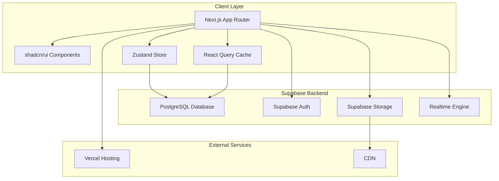

# Design Document

## Overview

The social media web application will be built as a modern, responsive single-page application (SPA) using React with Next.js 14+ for the frontend, Supabase for backend services, and shadcn/ui for the component library. The architecture follows a client-server model with real-time capabilities, leveraging Supabase's built-in authentication, database, storage, and real-time subscriptions.

## Architecture

### Technology Stack

**Frontend:**
- **Framework**: Next.js 14+ with App Router
- **UI Library**: shadcn/ui with Tailwind CSS
- **State Management**: Zustand for global state, React Query for server state
- **Real-time**: Supabase Realtime subscriptions
- **Authentication**: Supabase Auth with session management
- **File Upload**: Supabase Storage with drag-and-drop interface
- **Notifications**: React Hot Toast for in-app notifications

**Backend:**
- **Database**: PostgreSQL via Supabase
- **Authentication**: Supabase Auth (email/password, OAuth providers)
- **Storage**: Supabase Storage with CDN
- **Real-time**: Supabase Realtime for live updates
- **API**: Supabase auto-generated REST API and PostgreSQL functions

**Development Tools:**
- **TypeScript**: Full type safety across the application
- **ESLint & Prettier**: Code formatting and linting
- **Husky**: Git hooks for code quality
- **Vercel**: Deployment and hosting

### System Architecture



## Components and Interfaces

### Core Layout Components

**App Shell:**
- `RootLayout`: Main application wrapper with providers
- `Sidebar`: Navigation with user profile, feed, messages, notifications
- `TopBar`: Search, notifications, user menu
- `MobileNav`: Bottom navigation for mobile devices

**Authentication Components:**
- `AuthProvider`: Supabase auth context and session management
- `LoginForm`: Email/password login with shadcn/ui form components
- `RegisterForm`: User registration with profile setup
- `ProtectedRoute`: Route guard for authenticated users

### Feature Components

**User Profile:**
- `ProfileHeader`: Avatar, cover image, user stats, follow button
- `ProfileTabs`: Posts, media, followers, following tabs
- `EditProfile`: Profile editing modal with image upload
- `UserCard`: Compact user display for lists and suggestions

**Posts & Feed:**
- `PostComposer`: Rich text editor with media upload
- `PostCard`: Individual post display with interactions
- `FeedContainer`: Infinite scroll feed with real-time updates
- `PostModal`: Expanded post view with comments
- `MediaViewer`: Image/video carousel with zoom

**Messaging:**
- `ChatList`: Conversation list with search and filters
- `ChatWindow`: Message thread with real-time updates
- `MessageBubble`: Individual message component
- `MediaMessage`: Image/video/file message types
- `ChatComposer`: Message input with emoji picker and file upload

**Stories:**
- `StoriesBar`: Horizontal scrollable stories list
- `StoryViewer`: Full-screen story viewer with progress indicators
- `StoryComposer`: Story creation with camera/gallery access
- `StoryRing`: User avatar with story indicator

**Notifications:**
- `NotificationCenter`: Dropdown with notification list
- `NotificationItem`: Individual notification component
- `NotificationSettings`: Preference management

### Data Models and Interfaces

**User Interface:**
```typescript
interface User {
  id: string;
  uid: string;
  email?: string;
  username?: string;
  display_name?: string;
  biography?: string;
  avatar?: string;
  profile_cover_image?: string;
  account_premium: boolean;
  verify: boolean;
  followers_count: number;
  following_count: number;
  posts_count: number;
  created_at: string;
  updated_at: string;
}
```

**Post Interface:**
```typescript
interface Post {
  id: string;
  user_id: string;
  content?: string;
  media_urls?: string[];
  media_types?: string[];
  post_type: 'text' | 'image' | 'video' | 'mixed';
  visibility: 'public' | 'followers' | 'private';
  likes_count: number;
  comments_count: number;
  shares_count: number;
  created_at: string;
  updated_at: string;
  user?: User;
}
```

**Message Interface:**
```typescript
interface Message {
  id: string;
  chat_id: string;
  sender_id: string;
  content: string;
  message_type: 'text' | 'image' | 'video' | 'file';
  media_url?: string;
  created_at: number;
  is_deleted: boolean;
  is_edited: boolean;
  reply_to_id?: string;
  delivery_status: 'sent' | 'delivered' | 'read';
  sender?: User;
}
```

## Data Flow and State Management

### Global State (Zustand)

**Auth Store:**
- Current user session and profile
- Authentication status and loading states
- Login/logout actions

**UI Store:**
- Theme preferences (light/dark mode)
- Mobile sidebar state
- Modal and drawer states
- Notification preferences

**Chat Store:**
- Active chat sessions
- Unread message counts
- Typing indicators
- Online user presence

### Server State (React Query)

**Query Keys Structure:**
- `['posts', 'feed']`: Main feed posts
- `['posts', 'user', userId]`: User-specific posts
- `['messages', chatId]`: Chat messages
- `['notifications', userId]`: User notifications
- `['users', 'search', query]`: User search results

**Real-time Subscriptions:**
- Messages: Live chat updates
- Notifications: Real-time alerts
- User presence: Online status updates
- Post interactions: Live likes/comments

## Error Handling

### Client-Side Error Handling

**Network Errors:**
- Retry mechanisms with exponential backoff
- Offline state detection and queuing
- User-friendly error messages with shadcn/ui toast notifications

**Authentication Errors:**
- Automatic token refresh
- Redirect to login on session expiration
- Clear error messaging for auth failures

**Validation Errors:**
- Form validation with shadcn/ui form components
- Real-time field validation
- Server-side validation error display

### Database Error Handling

**RLS Policy Violations:**
- Graceful handling of permission errors
- User feedback for unauthorized actions
- Fallback UI states for restricted content

**Connection Issues:**
- Connection retry logic
- Offline mode with cached data
- Status indicators for connection state

## Testing Strategy

### Unit Testing
- Component testing with React Testing Library
- Custom hook testing for state management
- Utility function testing with Jest
- Mock Supabase client for isolated testing

### Integration Testing
- End-to-end user flows with Playwright
- Real-time feature testing with WebSocket mocks
- Authentication flow testing
- File upload and media handling tests

### Performance Testing
- Bundle size monitoring with Next.js analyzer
- Core Web Vitals tracking
- Image optimization testing
- Real-time subscription performance

## Security Considerations

### Authentication & Authorization
- Supabase RLS policies for data access control
- JWT token validation and refresh
- Secure session management
- OAuth provider integration

### Data Protection
- Input sanitization and validation
- XSS prevention with proper escaping
- CSRF protection via Supabase
- Secure file upload with type validation

### Privacy Controls
- User privacy settings enforcement
- Content visibility controls
- Data deletion and GDPR compliance
- Secure media storage with access controls

## Performance Optimization

### Frontend Optimization
- Next.js App Router with streaming SSR
- Image optimization with Next.js Image component
- Code splitting and lazy loading
- Service worker for offline functionality

### Database Optimization
- Efficient queries with proper indexing
- Pagination for large datasets
- Real-time subscription optimization
- Connection pooling via Supabase

### Caching Strategy
- React Query for server state caching
- Next.js static generation where applicable
- CDN caching for media files
- Browser caching for static assets

## Deployment Architecture

### Production Environment
- **Hosting**: Vercel with automatic deployments
- **Database**: Supabase managed PostgreSQL
- **CDN**: Supabase Storage with global CDN
- **Monitoring**: Vercel Analytics and Supabase Dashboard

### Environment Configuration
- Development, staging, and production environments
- Environment-specific Supabase projects
- Secure environment variable management
- Automated testing in CI/CD pipeline

This design provides a solid foundation for building a modern, scalable social media web application with excellent user experience and maintainable code architecture.